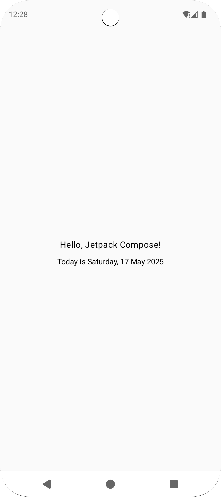
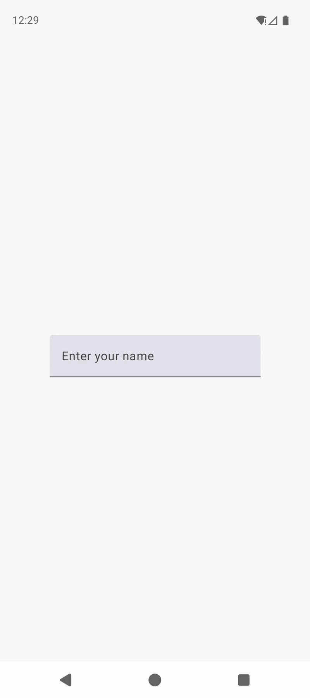
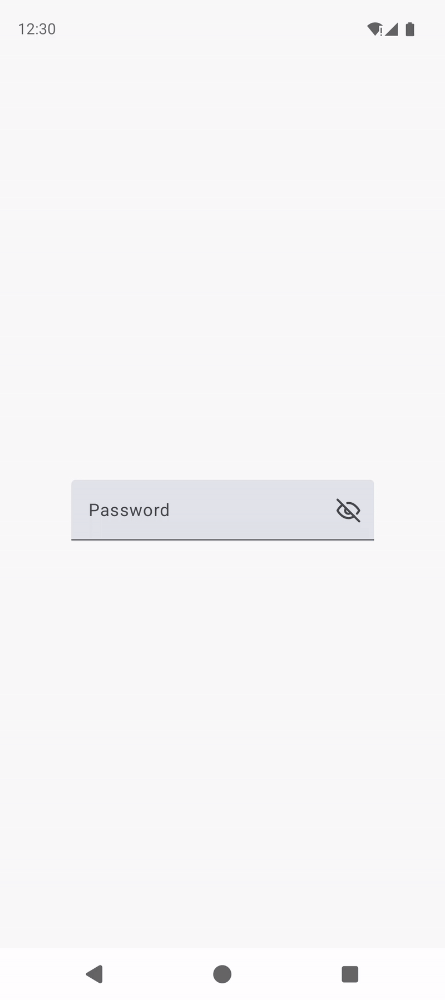
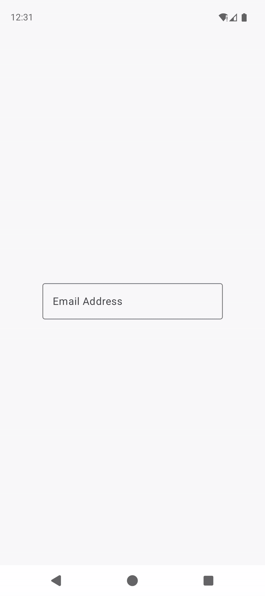

# Jetpack Compose Bits

**Jetpack Compose Bits** is a curated collection of small, focused Jetpack Compose code examples designed to help Android developers quickly understand and implement common UI components and interaction patterns.

Whether you're a beginner exploring the basics like `Text`, `Image`, and `TextField`, or a more experienced developer looking for reference snippets for `AlertDialog`, navigation, or layout compositions — this repository serves as a hands-on learning companion.

Each example is written in clean Kotlin with descriptive comments to make it easy to copy, adapt, and extend for real-world projects. With JetpackComposeBits, you can explore Compose features piece by piece — one "bit" at a time.

## 🔍 Features

- Composable UI elements with clear examples
- Well-commented Kotlin code
- Includes previews for faster development
- Useful for both learning and reference

---

Feel free to explore, clone, and contribute!

### Samples

| Example                                                                                                                                                                                                                               | Preview                                                                       |
|---------------------------------------------------------------------------------------------------------------------------------------------------------------------------------------------------------------------------------------|-------------------------------------------------------------------------------|
| [How do I display text on the screen using Jetpack Compose?](https://github.com/ChintanRathod/JetpackComoseBits/blob/main/app/src/main/java/com/jetpack/compse/example/text/SimpleTextGreetings.kt)                                   |          |
| [How can I get user input through a text box?](https://github.com/ChintanRathod/JetpackComoseBits/blob/d05f8841ad017b15b3b6947b23f0dc4af77f19ec/app/src/main/java/com/jetpack/compse/example/text/TextField.kt#L82C5-L82C26)          |     |
| [How can I get password input through a text box?](https://github.com/ChintanRathod/JetpackComoseBits/blob/d05f8841ad017b15b3b6947b23f0dc4af77f19ec/app/src/main/java/com/jetpack/compse/example/text/TextField.kt#L104C5-L104C29)    |  |
| [How can I get valid email input through a text box?](https://github.com/ChintanRathod/JetpackComoseBits/blob/d05f8841ad017b15b3b6947b23f0dc4af77f19ec/app/src/main/java/com/jetpack/compse/example/text/TextField.kt#L133C5-L133C33) |     |